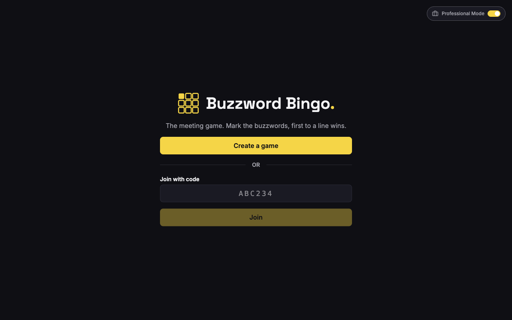
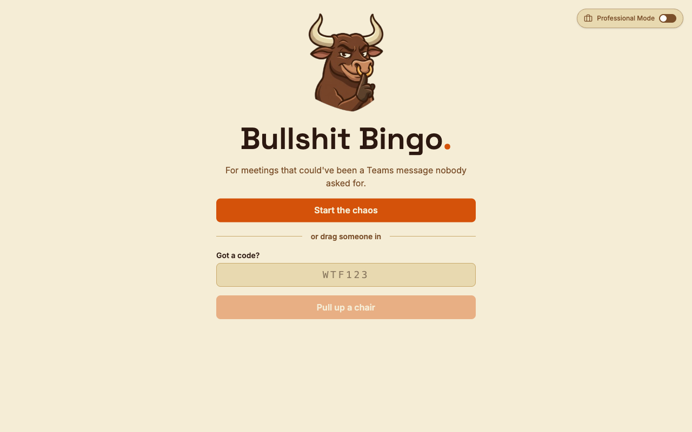
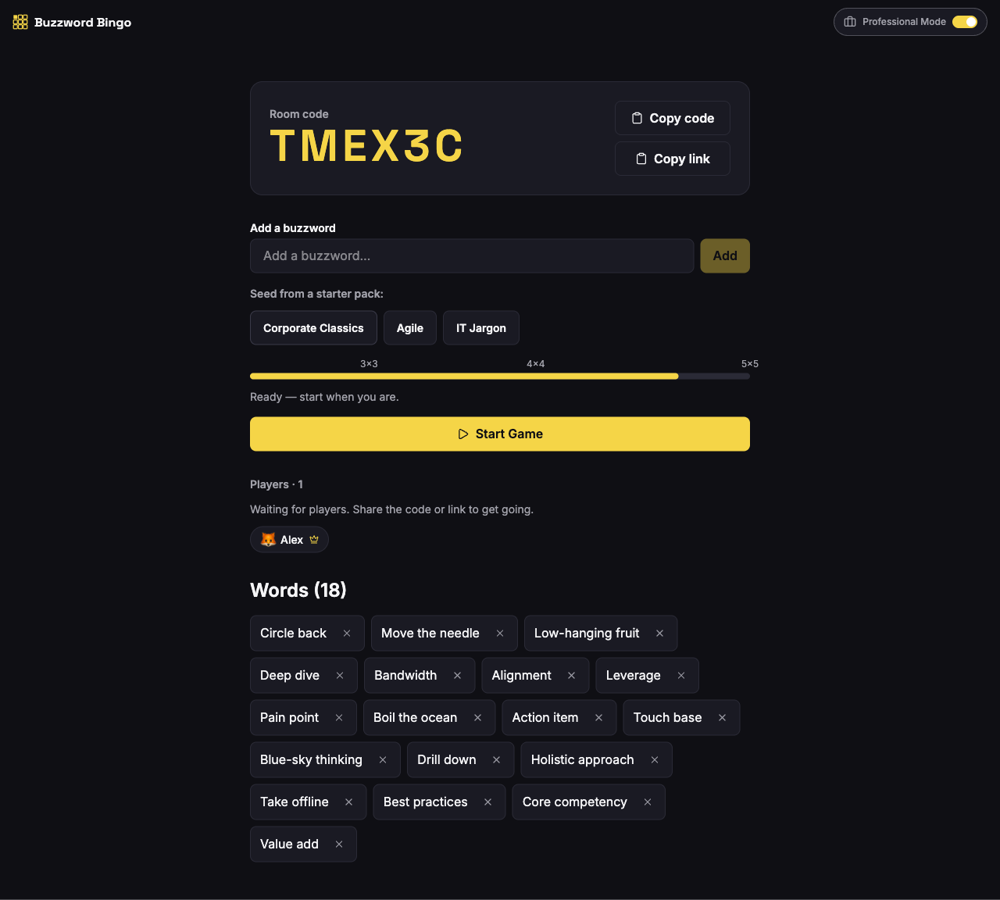
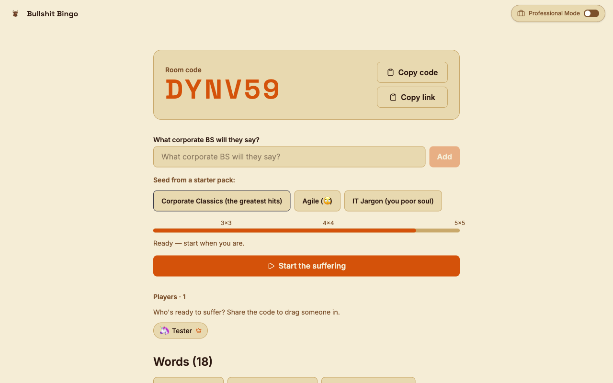
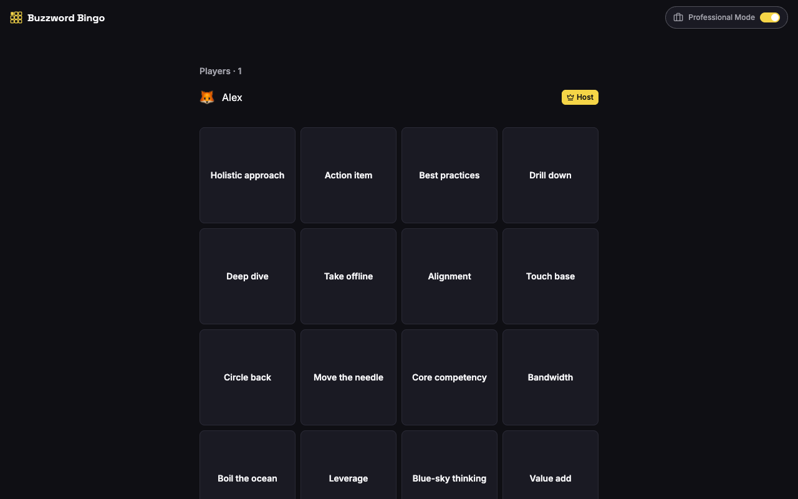
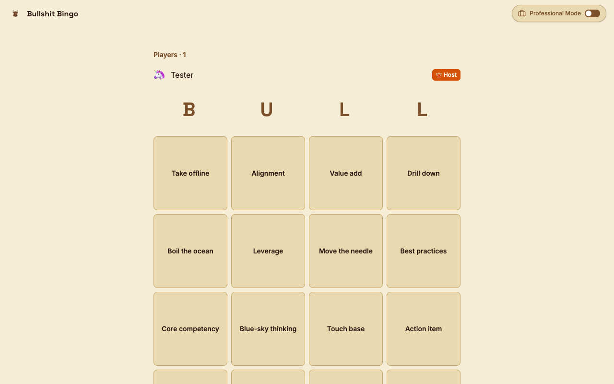
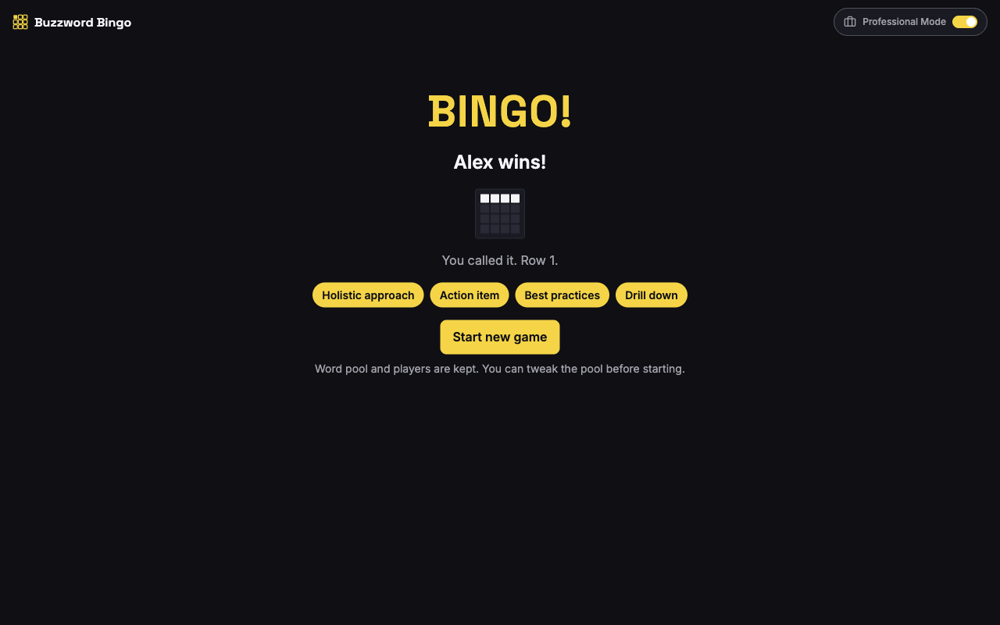

<div align="center">



# Buzzword Bingo

**The real-time bingo game for corporate meetings.**  
Everyone gets a board. First to a line wins. No sign-up required.

[](https://github.com/cdtm88/bs-bingo/actions/workflows/ci.yml)
[](https://kit.svelte.dev)
[](https://workers.cloudflare.com)
[](https://tailwindcss.com)
[](https://www.typescriptlang.org)

</div>

---

Join a room by link or 6-character code, submit the buzzwords you expect to hear, and race to mark them off as they're said. The server detects the win — no disputes, no honour system.

---

## Screenshots

| SFW — safe for screen share | NSFW — toggle off Professional Mode |
|---|---|
|  |  |
|  |  |
|  |  |

| Win screen |
|---|
|  |

---

## Features

- **Zero friction** — no account, no app; join from any browser by link or short code
- **Real-time** — marks sync to all players in ~100ms via WebSocket
- **Server-authoritative wins** — first to complete a row, column, or diagonal; no self-declaring
- **Auto-sizing boards** — 3×3, 4×4, or 5×5 based on the word pool size
- **Starter packs** — Corporate Classics, Agile, and IT Jargon to seed the pool instantly
- **Professional Mode** — one toggle hides the branding; safe for screen share, dangerous for morale
- **Reconnect-safe** — drops and rejoins restore full game state automatically

---

## Quick Start

Requires **Node.js ≥ 18** and **[pnpm](https://pnpm.io/)**.

```bash
git clone https://github.com/cdtm88/bs-bingo.git
cd bs-bingo
pnpm install
pnpm dev
```

Open **[http://localhost:8788](http://localhost:8788)**, create a room, share the code.

---

## How to Play

1. **Create** — hit *Create a game*, pick a name, copy the room link or 6-char code
2. **Add words** — type buzzwords you expect to hear, or load a starter pack
3. **Start** — the host clicks *Start Game*; every player gets a unique randomised board
4. **Mark** — tap a square when a buzzword is said in the meeting
5. **Win** — complete a full row, column, or diagonal first

---

## Professional Mode

Toggle **Professional Mode** (top-right corner) to flip between:

| | SFW | NSFW |
|---|---|---|
| **Name** | Buzzword Bingo | Bullshit Bingo |
| **Logo** | Grid icon | 🐂 Bull mascot |
| **Copy** | Neutral | Honest |

Leave it on for the screen share. Turn it off for the group chat.

---

## Tech Stack

| Layer | Technology |
|---|---|
| Frontend | SvelteKit 2 + Svelte 5 (runes) |
| Real-time | Cloudflare Durable Objects + WebSocket Hibernation |
| Coordination | PartyServer (Cloudflare-maintained WS framework) |
| Styling | Tailwind CSS v4 |
| Validation | Valibot |
| Deployment | Cloudflare Workers via Wrangler |

One Durable Object per room holds all game state in memory. Strong consistency inside the object serialises all moves without locks — the right model for a "first to win" race.

---

## Deploy

Requires a Cloudflare account on the **Workers Paid plan** ($5/mo) for Durable Objects.

```bash
pnpm build
wrangler deploy
```

---

## Documentation

| Doc | What's in it |
|---|---|
| [Architecture](docs/ARCHITECTURE.md) | System design, data flow, component diagram |
| [API](docs/API.md) | HTTP endpoints and full WebSocket message protocol |
| [Configuration](docs/CONFIGURATION.md) | `wrangler.jsonc`, game constants, tunable limits |
| [Development](docs/DEVELOPMENT.md) | Build commands, code style, local workflows |
| [Testing](docs/TESTING.md) | Unit tests (Vitest) and E2E tests (Playwright) |
| [Getting Started](docs/GETTING-STARTED.md) | Prerequisites, install, first run, common issues |
