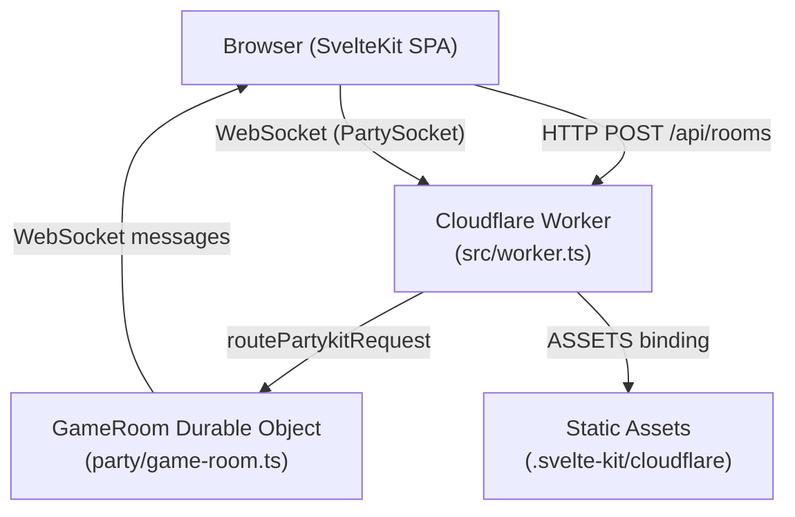

<!-- generated-by: gsd-doc-writer -->
# Architecture

Bullshit Bingo is a real-time multiplayer browser game. Players join ephemeral rooms, submit buzzwords into a shared pool, and each receive a unique randomized bingo board. The server detects wins authoritatively — no client can self-declare. The system is entirely serverless, deployed as a single Cloudflare Workers + Durable Objects unit with a SvelteKit frontend.

## Component Diagram



All request types funnel through a single Worker entry point. The Worker first attempts PartyServer routing for WebSocket traffic; non-WS requests fall through to the SvelteKit SSR handler, which serves both prerendered pages and the `/api/rooms` API route.

## Data Flow

A complete game session proceeds as follows:

1. **Room creation** — The browser POSTs to `/api/rooms`. The Worker's SvelteKit handler calls `POST /create` on a new `GameRoom` Durable Object stub identified by the generated 6-char code. The DO marks itself `#active = true` and returns `{ code, shareUrl }`.

2. **Join** — Players navigate to `/join/[code]`, which resolves via `+page.ts` server load and redirects to `/room/[code]`. The `room.svelte.ts` store instantiates a `PartySocket` connecting to the Worker at `party/game-room` with the room code and a `playerId` query parameter.

3. **WebSocket handshake** — On open, the client sends a `hello` message. The DO registers the player, assigns host to the first arrival, and broadcasts `playerJoined` to all other connections. Each connection is tagged with its `playerId` via `conn.setState`.

4. **Lobby** — Players submit words via `submitWord` messages. The DO deduplicates synchronously (no `await` between check and insert), persists to storage, and broadcasts `wordAdded` to all connections.

5. **Game start** — The host sends `startGame`. The DO transitions `#phase` to `"playing"`, broadcasts `gameStarted`, then sends each player a private `boardAssigned` message containing their unique shuffled board. Boards are never broadcast.

6. **Gameplay** — Players send `markWord` with a `cellId`. The DO verifies the cell belongs to that player's board, toggles the mark, broadcasts `wordMarked` (containing only `playerId`, `markCount`, and `cellId`), then runs `detectWin`. On a win it sets `#phase = "ended"` and broadcasts `winDeclared` with full win-line details.

7. **Reconnection** — On re-open, `PartySocket` sends `syncRequest`. The DO replies with a `syncResponse` containing the full `RoomState`, the player's board, their mark set, and win-line details if the game has ended.

8. **Reset** — The host sends `startNewGame`. The DO clears board/mark/winner state, retains the player roster and word pool, resets `#phase` to `"lobby"`, and broadcasts `gameReset`.

## Key Abstractions

| Abstraction | File | Description |
|---|---|---|
| `GameRoom` | `party/game-room.ts` | Durable Object — authoritative per-room actor. All game state lives here. |
| `ClientMessage` / `ServerMessage` | `src/lib/protocol/messages.ts` | Valibot-validated discriminated union of every WS message type. Single source of truth for the wire protocol. |
| `RoomState` | `src/lib/protocol/messages.ts` | Snapshot of public room state broadcast to all players (`code`, `phase`, `players`, `words`, `hostId`, etc.). Boards are excluded for privacy. |
| `createRoomStore` | `src/lib/stores/room.svelte.ts` | Svelte 5 runes-based reactive store. Opens the PartySocket, dispatches incoming messages, and exposes derived UI state (`board`, `markedCellIds`, `winner`, etc.). |
| `detectWin` | `src/lib/util/winLine.ts` | Pure function, shared between the DO (server win check) and the client (WinLineIcon/EndScreen). Grid size is inferred from `cells.length`. |
| `deriveGridTier` | `src/lib/util/gridTier.ts` | Maps word pool size to board tier: ≥21 words → 5×5, ≥12 → 4×4, ≥5 → 3×3. |
| `getOrCreatePlayer` | `src/lib/session.ts` | Reads or creates a `{ playerId, displayName }` from `sessionStorage`, keyed per room code. Zero-signup identity. |
| `POST /api/rooms` | `src/routes/api/rooms/+server.ts` | SvelteKit server route. Generates a 6-char code, calls `POST /create` on the DO stub, returns `{ code, shareUrl }`. Retries up to 5 times on collision. |

## WebSocket Hibernation and State Persistence

The `GameRoom` DO opts into Cloudflare's WebSocket Hibernation API (`static options = { hibernate: true }`). When all connections are idle, the DO is evicted from memory. Every mutation is immediately mirrored to `ctx.storage`. On wake, `onStart()` rehydrates all in-memory fields from storage before any `onConnect` handler can run (enforced by a hydration-guard promise).

Storage keys are narrow and explicit — each field has its own key (`hostId`, `players`, `words`, `boards`, `marks`, `phase`, `pendingSlots`, etc.) so `onStart` can rehydrate atomically via `Promise.all`.

## Reconnection and Slot-Hold

When a player disconnects (`onClose`), the DO places them in a 45-second `#pendingSlots` window rather than immediately removing them. A Durable Object alarm fires at the slot expiry. If the player reconnects within the window, they are restored to their existing board and mark state. If the slot expires, `playerLeft` is broadcast and the player is removed. If the departed player was the host, `#promoteNextHost` assigns host to the longest-standing connected player and broadcasts `hostChanged`.

## Board Generation

Boards are built per-player at game start. The word pool is shuffled independently for each player (`shuffle([...wordPool])`), sliced to `cellCount` (9/16/25 based on tier), and padded with blank cells if the pool is smaller than the grid. Blank cells count as free squares in win detection.

## Directory Structure

```
bs-bingo/
├── party/
│   └── game-room.ts        # Durable Object — all server game logic
├── src/
│   ├── worker.ts            # Cloudflare Worker entry: PartyServer routing + SvelteKit fallback
│   ├── routes/
│   │   ├── +page.svelte     # Home page (create room)
│   │   ├── api/rooms/       # POST /api/rooms — room creation API
│   │   ├── join/[code]/     # Join page — validates code, redirects to room
│   │   └── room/[code]/     # In-game page — mounts the room store + game UI
│   └── lib/
│       ├── protocol/
│       │   └── messages.ts  # Wire protocol types and Valibot schemas
│       ├── stores/
│       │   ├── room.svelte.ts  # Reactive game state store (PartySocket + runes)
│       │   └── theme.svelte.ts # SFW/NSFW theme toggle
│       ├── components/      # Svelte UI components (Board, EndScreen, WordPool, etc.)
│       ├── session.ts       # sessionStorage-backed player identity
│       └── util/            # Pure helpers: gridTier, winLine, shuffle, roomCode, etc.
├── wrangler.jsonc           # Worker + DO bindings, asset serving config
└── scripts/
    └── patch-worker.mjs    # Post-build: injects GameRoom export + PartyServer routing into worker.ts
```

## Build and Deployment

SvelteKit compiles the frontend via Vite to `.svelte-kit/cloudflare`. A post-build script (`scripts/patch-worker.mjs`) patches the generated `src/worker.ts` to re-export the `GameRoom` class and wrap the SvelteKit handler with `routePartykitRequest`. Wrangler then deploys the single bundle to Cloudflare Workers with the `GameRoom` Durable Object binding declared in `wrangler.jsonc`.
